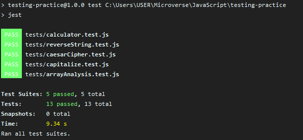

# ✨ testing-practice

<div align="center"></div>

## 📝 Table of Contents

* [About the Project](#about-the-project)
  * [Built With](#built-with)
* [Getting started](#getting-started)
* [Contact](#contact)
* [Acknowledgements](#acknowledgements)

<!-- ABOUT THE PROJECT -->
## 👉 About The Project

This is a practice for testing  a series of JavaScript ES6 functions using jest and babel environment.

Link for project specifications: [Odin-Project](https://www.theodinproject.com/courses/javascript/lessons/testing-practice)

### 🛠 Built With

*   npm
*   JavaScript
*   Babel
*   Jest

## 👉 Getting Started

Simply clone the repo on your computer.

In you favorite bash run:
```bash
npm install
npm run test
```

<!-- CONTACT & SUPPORT -->
## Contact & Support

🙍 Guadalupe Rangel - kanemekanik@gmail.com - ☄

🙍‍♂ Mario Dena - mario_dena@outlook.com - 🖥

You liked it? ⭐️ Star our project!!!

<!-- ACKNOWLEDGEMENTS -->
## Acknowledgements

* [Microverse](https://www.microverse.org/)